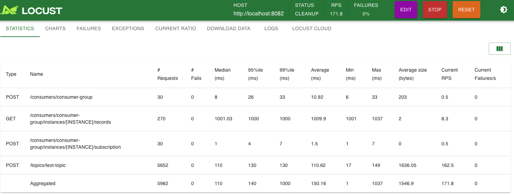

Performance tests
=================

Install development requirements per instructions from `README.rst <../README.rst>`_

Requires Kafka and Zookeeper running in the containers::
  cd ../container
  docker compose start zookeeper kafka

Create if necessary the `_schemas` topic to Kafka::
  docker exec -it <KAFKA_POD_ID> bash
  kafka-topics --bootstrap-server localhost:9092 --create --topic _schemas --config cleanup.policy=compact

Run Karapace from repository root::
  cd ..
  python -m karapace.karapace_rest_apis karapace.config.json

Before running performance test, make sure
- locust is installed. (pip install locust)
- kafka module is installed (pip install kafka-python)
Performance test is run from the shell script::
  ./run-locust-test.sh

A web interface must be running on http://0.0.0.0:8089/ to run tests

Here is a screenshot of performance tests locally.

Script supports some environment variables:
 * `BASE_URL` for setting Karapace address and port.
 * `TOPIC` for setting the topic name where data is produced.
 * `DURATION` for setting how long the test runs.
 * `CONCURRENCY` for setting how many concurrent users are emulated.
 * `LOCUST_GUI` for enabling the Locust web user interface.
 * `LOCUST_FILE` for selecting the Locust test script.
