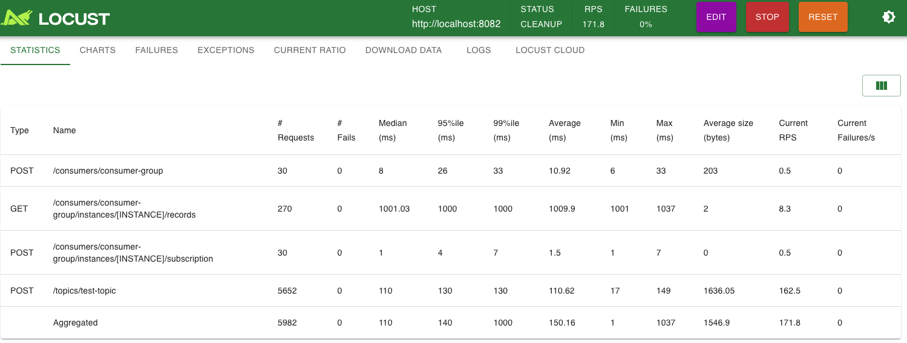

Performance tests
=================

Install development requirements per instructions from `README.rst <../README.rst>`_

Requires Kafka and Zookeeper running in the containers::

  cd ../container
  docker compose start zookeeper kafka

Create if necessary the `_schemas` topic to Kafka::

  docker exec -it <KAFKA_POD_ID> bash
  kafka-topics --bootstrap-server localhost:9092 --create --topic _schemas --config cleanup.policy=compact

Run Karapace from repository root::

  cd ..
  python -m karapace.karapace_rest_apis karapace.config.json

Before running performance test, make sure:

- locust is installed. (pip install locust)
- kafka module is installed (pip install kafka-python)

Performance test is run from the shell script::

  ./run-locust-test.sh

Direct script usage opens the Locust web UI by default and autostarts the run. To force a headless run::

  LOCUST_GUI=0 ./run-locust-test.sh

To run with metrics collection enabled::

  COLLECT_DOCKER_STATS=1 ./run-locust-test.sh

Or use the dedicated Make targets from the repository root (headless by default)::

  make performance-test-rest-proxy
  make performance-test-schema-registry

For the schema-registry Locust test, the dedicated Make target uses the local HTTPS schema-registry endpoint::

  make performance-test-schema-registry

The script also fetches an OIDC bearer token automatically for `schema-registry-schema-post.py` by calling
`bin/get_oidc_token.py`, using `KEYCLOAK_CONNECT_URL=http://localhost:8383` by default.

A web interface must be running on http://0.0.0.0:8089/ to run tests

Here is a screenshot of performance tests locally.

Script supports some environment variables:
 * `BASE_URL` for setting Karapace address and port.
 * `TOPIC` for setting the topic name where data is produced.
 * `DURATION` for setting how long the test runs.
 * `CONCURRENCY` for setting how many concurrent users are emulated.
 * `CONSUME_TIMEOUT` for setting the REST proxy records-poll timeout in milliseconds. Lower values increase poll
   frequency and usually raise req/s for consume-heavy runs. The default is `1000`.
 * `PRODUCE_TASK_WEIGHT` for setting how often each user produces records relative to consume requests. The default is
   `1`.
 * `CONSUME_TASK_WEIGHT` for setting how often each user reads records relative to produce requests. The default is
   `5`, so the test now puts more pressure on the records-consumption path while still keeping many consumer
   instances alive.
 * `SCHEMA_REGISTER_NEW_WEIGHT` for setting how often the schema-registry load test registers new schemas. The default
   is `10`.
 * `SCHEMA_CHECK_REGISTERED_WEIGHT` for setting how often the schema-registry load test checks already-registered
   schemas. The default is `10`.
 * `LOCUST_SPAWN_RATE` for setting how many users per second Locust should add while ramping up. The default is `10`.
 * `LOCUST_GUI` for enabling the Locust web user interface (`1` by default, `0` to force a headless run).
 * `LOCUST_AUTOQUIT` for telling Locust how many seconds after a completed GUI run it should shut down the web UI.
   The default is `0`, which keeps the current behavior of leaving the UI running indefinitely.
 * `LOCUST_FILE` for selecting the Locust test script.
 * `LOCUST_STOP_TIMEOUT` for setting how many seconds Locust should wait for users to finish their current work and
   run `on_stop()` cleanup before force-stopping them. The default is `30`.
 * `COLLECT_DOCKER_STATS` for enabling Docker stats sampling during the run. The default is `0`, so plain load runs do
   not collect container metrics unless explicitly requested.
 * `CLEAN_RESULTS` for deleting the selected results subdirectory before a run starts. The default is `0`, so previous
   artifacts are kept unless you opt in.
 * `DOCKER_STATS_INTERVAL` for setting the Docker stats sampling interval in seconds.
 * `DOCKER_STATS_CONTAINERS` for overriding the sampled container list. By default the script tracks
   `karapace-rest-proxy`, `karapace-schema-registry`, `karapace-schema-registry-follower`, `kafka`, and `keycloak`.
 * `DOCKER_STATS_POST_RUN_DELAY` for keeping Docker stats collection running a few seconds after Locust stops.

When Docker stats collection is enabled, `run-locust-test.sh` samples container resource usage while Locust is
running and writes the final CSV and table-formatted log only after the Locust process exits. By default it also
waits 10 seconds after Locust finishes before stopping Docker stats collection, so the final snapshots show whether
resource usage returns to idle levels.

The REST proxy load test creates one REST proxy consumer instance per Locust user. Each user both produces and
consumes, with consume requests weighted more heavily by default. This keeps the many-consumer-instance behavior while
driving more traffic through the records-consumption path.

Artifacts are written under `performance-test/results/rest-proxy/` or `performance-test/results/schema-registry/`.
